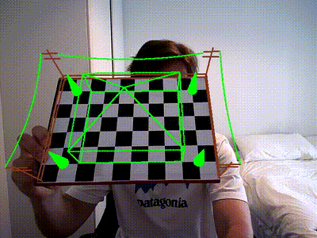
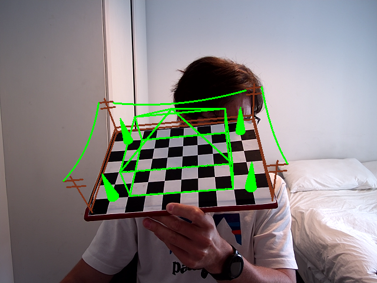
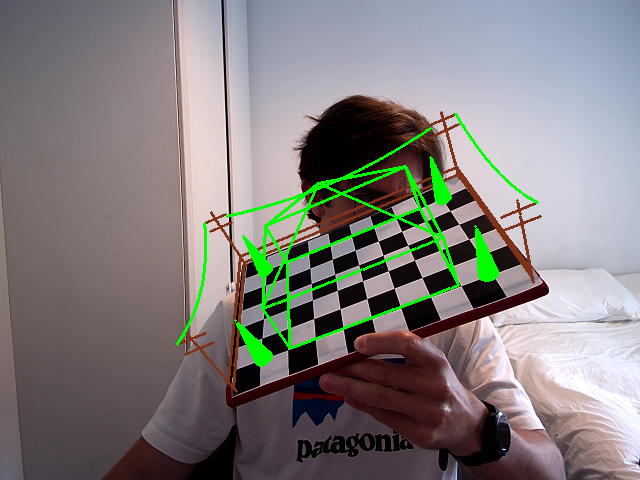
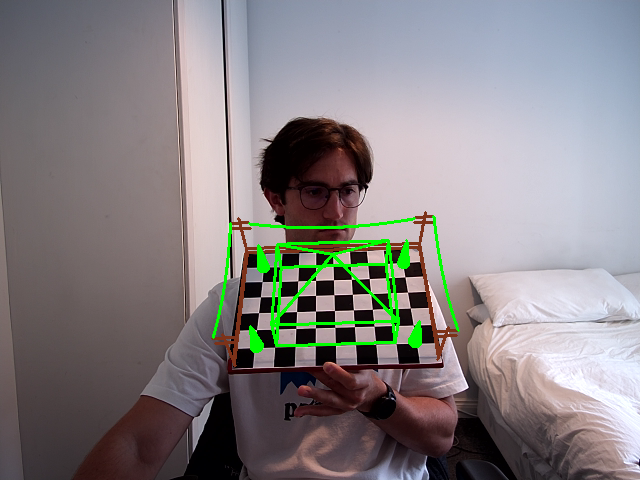
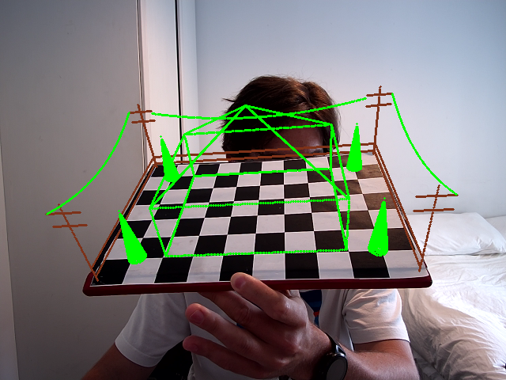

## ChristmasProject2023 

This is a simple augmented reality application that detects a checkerboard pattern in a webcam feed and projects a hardcoded 3D Christmas village onto it. The project uses OpenCV for camera calibration, checkerboard detection, and rendering, without relying on OpenGL. You can calibrate your camera with your own images, then see a festive scene mapped onto the checkerboard in real time.

<table>
  <tr>
    <td></td>
    <td></td>
  </tr>
</table>

<table>
  <tr>
    <td></td>
    <td></td>
  </tr>
</table>

Built and tested with C++ 14, OpenCV 4.6, Linux. There is no OS dependent code so should build fine for Windows and Mac as well. Makefile and CMakeLists.txt would need modifications for your system. I used a checkerboard 10 blocks in width, 7 blocks in height, 28.0mm in block size (fits an A4 page). The code performs camera calibration based on the command line arguments. If not, it tries to load in exiting camera parameters from /CameraParams/cameraParams.xml - which is where the calibration saves its results the first time it runs. 

